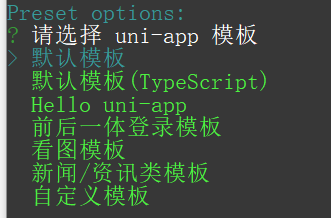
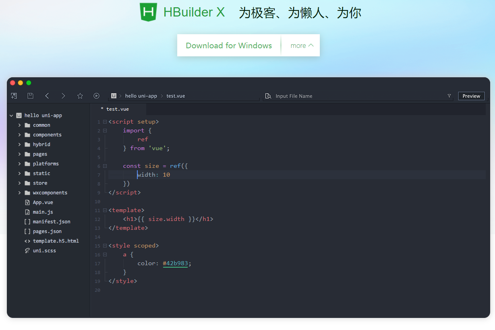
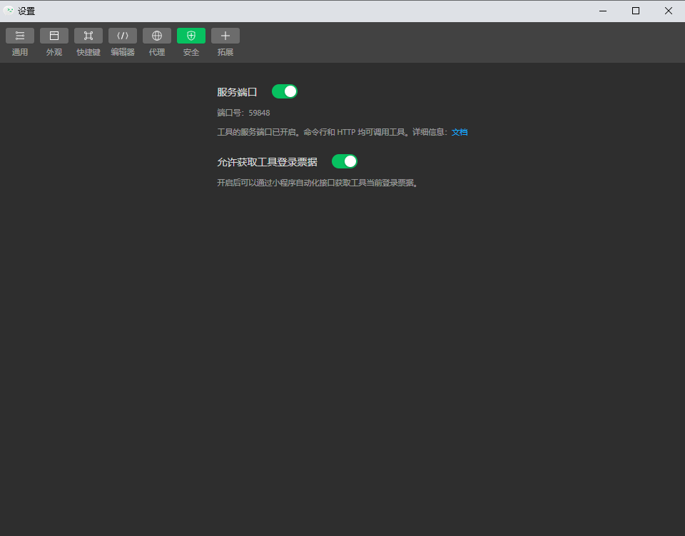
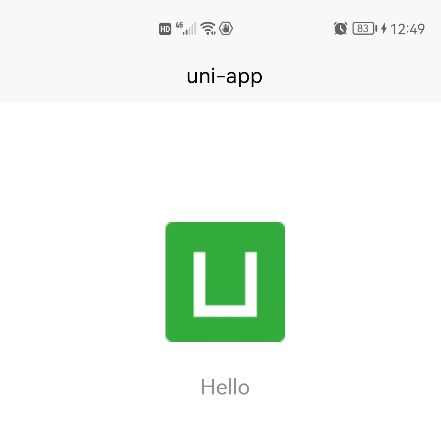

# 玩转 uniapp 全端开发

## uniapp 介绍

`uni-app` 是一个使用 [Vue.js (opens new window)](https://vuejs.org/)开发所有前端应用的框架，开发者编写一套代码，可发布到iOS、Android、Web（响应式）、以及各

种小程序（微信/支付宝/百度/头条/飞书/QQ/快手/钉钉/淘宝）、快应用等多个平台。

是目前**全端开发框架的佼佼者**

---


---

### 多端体验


### uniapp 优势


## uniapp 生态介绍


1. [uview](https://www.uviewui.com/)
2. uni ui
   1. [使用文档](https://uniapp.dcloud.net.cn/component/uniui/uni-ui.html)
   2. [完整示例](https://hellouniapp.dcloud.net.cn/pages/component/view/view)
3. [hbuilderX](https://www.dcloud.io/hbuilderx.html)
4. [插件市场](https://ext.dcloud.net.cn/)
5. [uniCloud](https://uniapp.dcloud.net.cn/uniCloud/)


## uniapp项目创建 

uniapp 项目开发方式分为两种

1. vue-cli  
2. HBuilderX 可视化 （**多端开发首选**）


### vue-cli  

#### 创建项目 

1. 全局安装vue-cli

   ```shell
   npm install -g @vue/cli@4
   ```

2. 创建项目

   ```shell
   vue create -p dcloudio/uni-preset-vue my-project
   ```

3. 选择模版- *选择默认模版*

   

4. 成功 

   

   
#### 运行项目


```shell
npm run dev:平台代号
npm run build:平台代号
```

| 值                      | 平台                                                         |
| ----------------------- | ------------------------------------------------------------ |
| app-plus                | app平台生成打包资源（支持npm run build:app-plus，可用于持续集成。不支持run，运行调试仍需在HBuilderX中操作） |
| h5                      | H5                                                           |
| mp-alipay               | 支付宝小程序                                                 |
| mp-baidu                | 百度小程序                                                   |
| mp-weixin               | 微信小程序                                                   |
| mp-toutiao              | 字节跳动小程序                                               |
| mp-lark                 | 飞书小程序                                                   |
| mp-qq                   | qq 小程序                                                    |
| mp-360                  | 360 小程序                                                   |
| mp-kuaishou             | 快手小程序                                                   |
| mp-jd                   | 京东小程序                                                   |
| mp-xhs                  | 小红书小程序                                                 |
| quickapp-webview        | 快应用(webview)                                              |
| quickapp-webview-union  | 快应用联盟                                                   |
| quickapp-webview-huawei | 快应用华为                                                   |


### HBuilderX 

如果你要使用uiapp开发多端，那么就必须要选择和它配套的编辑工具了 `HBuilderX`  。考虑到后期要使用更多的 uniapp的功能，建议提前注册一个uniapp的开发账号。 [注册](https://account.dcloud.net.cn/oauth2?reg=2&redirect_uri=http://ext.dcloud.net.cn/auth/dcloud/callback&client_id=DCLOUD_DEV&response_type=code)




#### 创建项目

1. [下载 HBuilderX](https://www.dcloud.io/hbuilderx.html)

2. 新建项目

   

3. 选择项目

   

4. 创建成功

   

5. 编辑器中，敲入 `u`+代码  即可调出HBuilderX的代码提示

   


#### 运行项目

> 第一次运行，可能需要安装插件，等待即可


## uniapp 开发环境搭建

uniapp 是全端开发框架，假如我们想要开发全端，那么首先需要搭建好各个端对应的环境。以下拿比较典型的 微信小程序、H5 和 安卓App来演示。 *发布环境的讲解在后续*


### 微信小程序

#### 下载开发者工具

> [下载地址](https://developers.weixin.qq.com/miniprogram/dev/devtools/download.html)


下载安装成功后，会在桌面上显示出来一个图标 


#### 注册微信小程序开发者账号

另外 想要开发一款微信小程序，必须要注册[微信开发者账号](https://mp.weixin.qq.com/cgi-bin/registermidpage?action=index&lang=zh_CN&token=)，同时获取对应的appid。


---

#### 获取appid


---

#### 打开服务端口




#### 在 HBuilderX 中运行项目


### H5

> 如果使用内置的浏览器预览页面，它是自带跨域的。
>
> 同时每一个vue页面中的样式，也是默认自己加上 `scoped` 的。

运行H5比较简单，只需要电脑上安装好浏览器就行，或者使用 HBuilderX自带内置浏览器也可以


### App

由于电脑操作系统限制，我们只演示 `android`。

分为两种:

1. 运行到模拟器
2. 运行到真机

#### 运行到模拟器

安卓模拟器可以自由选择，这里我使用的是 **Android studio** 内置的模拟器


---

安装 android studio 模拟器步骤如下：

1. [下载   android studio](https://developer.android.google.cn/studio) 

   

   2. 打开安装包，然后 **勾选上** 安装虚拟机

      

   3. 打开  `Android Studio`

      

   4. 

   5. 选择要安装的手机型号

      

   6. 选择安装对应的安卓系统版本  *下载过程比较慢，因为系统镜像比较大*

      

   7. 下载成功了，回到设备列表页面，运行起来

      

      ---

      

   8. 开机 

      

   9. 成功

      

   10. 现在可以回到HBuilderX中来运行项目到模拟器里面了

       

   11. HBuilderX会自动检测你电脑上的模拟器或者真实安卓手机

       

       

   12. 成功

       

   

   

   

#### 运行到真实手机

1. 准备一台正常的安卓手机，开启**开发人员选项**和**允许USB调试**

   

2. 连接数据线到电脑上 ，如果弹出什么菜单全部点击**允许**

3. 这个时候，重新回到 HBuilderX中，点击运行项目到 **App上**

   

   ---

   

   

4. 此时你的手机会弹出窗口，提示你安装软件，最后成功显示

   

#### App 调试 模拟器调试

1. 运行模拟器

2. 运行项目

3. 打开webview调试 *该选项只能调试页面标签和样式，不能调试js*

   

4. 点击**调试**

   

5. 此时会打开一个页面调试工具，开始调试

   

6. 模拟器上也会跟着发生变化

   

7. 此时可以开启 **js调试**

   

8. 此时会弹出一个新的窗口 我们可以在这里进行调试

   

#### App 真机调试

调试方式和 调试模拟器类似。直接操作即可


## uniapp 项目结构介绍

> https://uniapp.dcloud.net.cn/tutorial/project.html

```
┌─uniCloud              云空间目录，阿里云为uniCloud-aliyun,腾讯云为uniCloud-tcb 
│─components            符合vue组件规范的uni-app组件目录
│  └─comp-a.vue         可复用的a组件
├─hybrid                App端存放本地html文件的目录
├─platforms             存放各平台专用页面的目录
├─pages                 业务页面文件存放的目录
│  ├─index
│  │  └─index.vue       index页面
│  └─list
│     └─list.vue        list页面
├─static                存放应用引用的本地静态资源（如图片、视频等）的目录，注意：静态资源只能存放于此
├─uni_modules           存放[uni_module](/uni_modules)。
├─wxcomponents          存放小程序组件的目录
├─nativeplugins         App原生插件 详见
├─unpackage             非工程代码，一般存放运行或发行的编译结果
├─main.js               Vue初始化入口文件
├─App.vue               应用配置，用来配置App全局样式以及监听 应用生命周期
├─manifest.json         配置应用名称、appid、logo、版本等打包信息
├─pages.json            配置页面路由、导航条、选项卡等页面类信息
└─uni.scss              这里是uni-app内置的常用样式变量
```


## uniapp 开发规范介绍

为了实现多端兼容，综合考虑编译速度、运行性能等因素，`uni-app` 约定了如下开发规范


### 页面和组件文件遵循vue的规范

1. 比如 新建页面     `goods.vue`
2. 比如 新建组件     `it-item.vue`


### 内置标签使用小程序的规范

```vue
<view>小程序中的块级标签</view>
```


### 数据绑定和事件处理使用vue的规范

```vue
<template>
	<view>
		<view class="item" v-for="item in list" :key="item" @click="handleClick(item)">{{item}}</view>
	</view>
</template>
<script>
	export default {
		data(){
			return {
				list:['a','b','c']
			}
		},
		methods:{
			handleClick(letter){
				console.log(letter)
			}
		}
	}
</script>
```


### 能力接口API 使用 微信小程序的规范

比如弹出显示框，发送网络请求等

```js
wx.showToast({
  title: '成功',
  icon: 'success',
  duration: 2000
})

wx.request({
  url: 'example.php', //仅为示例，并非真实的接口地址
  data: {
    x: '',
    y: ''
  },
  header: {
    'content-type': 'application/json' // 默认值
  },
  success (res) {
    console.log(res.data)
  }
})
```

考虑到跨端，我们将会使用 `uniapp` 统一封装的API。简称 `uni api`

### uniapp 生命周期

uniapp中，生命周期分类三大类

1. 应用生命周期 *小程序规范*
2. 页面生命周期 *小程序规范*
3. 组件生命周期  *vue规范*


#### 应用生命周期

| 函数名               | 说明                                                         |
| :------------------- | :----------------------------------------------------------- |
| onLaunch             | 当`uni-app` 初始化完成时触发（全局只触发一次）               |
| onShow               | 当 `uni-app` 启动，或从后台进入前台显示                      |
| onHide               | 当 `uni-app` 从前台进入后台                                  |
| onError              | 当 `uni-app` 报错时触发                                      |
| onUniNViewMessage    | 对 `nvue` 页面发送的数据进行监听，可参考 [nvue 向 vue 通讯(opens new window)](https://uniapp.dcloud.io/tutorial/nvue-api?id=communication) |
| onUnhandledRejection | 对未处理的 Promise 拒绝事件监听函数（2.8.1+）                |
| onPageNotFound       | 页面不存在监听函数                                           |
| onThemeChange        | 监听系统主题变化                                             |


#### 页面生命周期

| 函数名                              | 说明                                                         | 平台差异说明                                                 | 最低版本 |
| :---------------------------------- | :----------------------------------------------------------- | :----------------------------------------------------------- | :------- |
| onInit                              | 监听页面初始化，其参数同 onLoad 参数，为上个页面传递的数据，参数类型为 Object（用于页面传参），触发时机早于 onLoad | 百度小程序                                                   | 3.1.0+   |
| onLoad                              | 监听页面加载，其参数为上个页面传递的数据，参数类型为 Object（用于页面传参），参考[示例](https://uniapp.dcloud.net.cn/api/router#navigateto) |                                                              |          |
| onShow                              | 监听页面显示。页面每次出现在屏幕上都触发，包括从下级页面点返回露出当前页面 |                                                              |          |
| onReady                             | 监听页面初次渲染完成。注意如果渲染速度快，会在页面进入动画完成前触发 |                                                              |          |
| onHide                              | 监听页面隐藏                                                 |                                                              |          |
| onUnload                            | 监听页面卸载                                                 |                                                              |          |
| onResize                            | 监听窗口尺寸变化                                             | App、微信小程序、快手小程序                                  |          |
| onPullDownRefresh                   | 监听用户下拉动作，一般用于下拉刷新，参考[示例](https://uniapp.dcloud.net.cn/api/ui/pulldown) |                                                              |          |
| onReachBottom                       | 页面滚动到底部的事件（不是scroll-view滚到底），常用于下拉下一页数据。具体见下方注意事项 |                                                              |          |
| onTabItemTap                        | 点击 tab 时触发，参数为Object，具体见下方注意事项            | 微信小程序、QQ小程序、支付宝小程序、百度小程序、H5、App、快手小程序、京东小程序 |          |
| onShareAppMessage                   | 用户点击右上角分享                                           | 微信小程序、QQ小程序、支付宝小程序、字节小程序、飞书小程序、快手小程序、京东小程序 |          |
| onPageScroll                        | 监听页面滚动，参数为Object                                   | nvue暂不支持                                                 |          |
| onNavigationBarButtonTap            | 监听原生标题栏按钮点击事件，参数为Object                     | App、H5                                                      |          |
| onBackPress                         | 监听页面返回，返回 event = {from:backbutton、 navigateBack} ，backbutton 表示来源是左上角返回按钮或 android 返回键；navigateBack表示来源是 uni.navigateBack ；详细说明及使用：[onBackPress 详解 (opens new window)](http://ask.dcloud.net.cn/article/35120)。支付宝小程序只有真机能触发，只能监听非navigateBack引起的返回，不可阻止默认行为。 | app、H5、支付宝小程序                                        |          |
| onNavigationBarSearchInputChanged   | 监听原生标题栏搜索输入框输入内容变化事件                     | App、H5                                                      | 1.6.0    |
| onNavigationBarSearchInputConfirmed | 监听原生标题栏搜索输入框搜索事件，用户点击软键盘上的“搜索”按钮时触发。 | App、H5                                                      | 1.6.0    |
| onNavigationBarSearchInputClicked   | 监听原生标题栏搜索输入框点击事件（pages.json 中的 searchInput 配置 disabled 为 true 时才会触发） | App、H5                                                      | 1.6.0    |
| onShareTimeline                     | 监听用户点击右上角转发到朋友圈                               | 微信小程序                                                   | 2.8.1+   |
| onAddToFavorites                    | 监听用户点击右上角收藏                                       | 微信小程序                                                   | 2.8.1+   |

#### 组件生命周期

|               |                                                              |              |          |
| :------------ | :----------------------------------------------------------- | :----------- | :------- |
| 函数名        | 说明                                                         | 平台差异说明 | 最低版本 |
| beforeCreate  | 在实例初始化之前被调用。[详见(opens new window)](https://cn.vuejs.org/v2/api/#beforeCreate) |              |          |
| created       | 在实例创建完成后被立即调用。[详见(opens new window)](https://cn.vuejs.org/v2/api/#created) |              |          |
| beforeMount   | 在挂载开始之前被调用。[详见(opens new window)](https://cn.vuejs.org/v2/api/#beforeMount) |              |          |
| mounted       | 挂载到实例上去之后调用。[详见 (opens new window)](https://cn.vuejs.org/v2/api/#mounted)注意：此处并不能确定子组件被全部挂载，如果需要子组件完全挂载之后在执行操作可以使用`$nextTick`[Vue官方文档(opens new window)](https://cn.vuejs.org/v2/api/#Vue-nextTick) |              |          |
| beforeUpdate  | 数据更新时调用，发生在虚拟 DOM 打补丁之前。[详见(opens new window)](https://cn.vuejs.org/v2/api/#beforeUpdate) | 仅H5平台支持 |          |
| updated       | 由于数据更改导致的虚拟 DOM 重新渲染和打补丁，在这之后会调用该钩子。[详见(opens new window)](https://cn.vuejs.org/v2/api/#updated) | 仅H5平台支持 |          |
| beforeDestroy | 实例销毁之前调用。在这一步，实例仍然完全可用。[详见(opens new window)](https://cn.vuejs.org/v2/api/#beforeDestroy) |              |          |
| destroyed     | Vue 实例销毁后调用。调用后，Vue 实例指示的所有东西都会解绑定，所有的事件监听器会被移除，所有的子实例也会被销毁。[详见(opens new window)](https://cn.vuejs.org/v2/api/#destroyed) |              |          |


### 响应式单位 rpx

> https://uniapp.dcloud.net.cn/tutorial/syntax-css.html#尺寸单位


相对长度单位，功能类似于web端的 rem 和 vw，小程序首先推出，uniapp也是直接支持。一种根据屏幕宽度自适应的动态单位。以 750 宽的屏幕为基准，750rpx 恰好为屏幕宽度。

其中uniapp做了以下设置，

1. 默认的设计稿宽度为 `375px`  因此存在  `1px = 2rpx` 
2. 默认 rpx支持最大宽度为  `960px`,超出则 按照 设计稿宽度 `375px` 来设置

## uniapp 多端开发

### 条件编译

条件编译是用特殊的注释作为标记，在编译时根据这些特殊的注释，将注释里面的代码编译到不同平台。

**写法：**以 #ifdef 或 #ifndef 加 **%PLATFORM%** 开头，以 #endif 结尾。

- \#ifdef：if defined 仅在某平台存在
- \#ifndef：if not defined 除了某平台均存在
- **%PLATFORM%**：平台名称


**标签中**

```html
<!--  #ifdef  %PLATFORM% -->
平台特有的组件
<!--  #endif -->
```

**js中**

```js
// #ifdef  %PLATFORM%
平台特有的API实现
// #endif
```

**css**中

```css
/*  #ifdef  %PLATFORM%  */
平台特有样式
/*  #endif  */
```

| 条件编译写法                                             | 说明                                                         |
| -------------------------------------------------------- | ------------------------------------------------------------ |
| #ifdef **APP-PLUS** 需条件编译的代码 #endif              | 仅出现在 App 平台下的代码                                    |
| #ifndef **H5** 需条件编译的代码 <br />#endif             | 除了 H5 平台，其它平台均存在的代码                           |
| #ifdef **H5** \|\| **MP-WEIXIN** 需条件编译的代码 #endif | 在 H5 平台或微信小程序平台存在的代码（这里只有\|\|，不可能出现&&，因为没有交集） |

**%PLATFORM%** **可取值如下：**

| 值                      | 生效条件                                                     |
| :---------------------- | :----------------------------------------------------------- |
| VUE3                    | HBuilderX 3.2.0+ [详情(opens new window)](https://ask.dcloud.net.cn/article/37834) |
| APP-PLUS-NVUE或APP-NVUE | App nvue                                                     |
| MP-WEIXIN               | 微信小程序                                                   |
| MP-ALIPAY               | 支付宝小程序                                                 |
| MP-BAIDU                | 百度小程序                                                   |
| MP-TOUTIAO              | 字节跳动小程序                                               |
| MP-LARK                 | 飞书小程序                                                   |
| MP-QQ                   | QQ小程序                                                     |
| MP-KUAISHOU             | 快手小程序                                                   |
| MP-JD                   | 京东小程序                                                   |
| MP-360                  | 360小程序                                                    |
| MP                      | 微信小程序/支付宝小程序/百度小程序/字节跳动小程序/飞书小程序/QQ小程序/360小程序 |
| QUICKAPP-WEBVIEW        | 快应用通用(包含联盟、华为)                                   |
| QUICKAPP-WEBVIEW-UNION  | 快应用联盟                                                   |
| QUICKAPP-WEBVIEW-HUAWEI | 快应用华为                                                   |

**支持的文件**

- .vue
- .js
- .css
- pages.json
- 各预编译语言文件，如：.scss、.less、.stylus、.ts、.pug


#### static 目录的条件编译

在不同平台，引用的静态资源可能也存在差异，通过 static 的的条件编译可以解决此问题，static 目录下新建不同平台的专有目录（目录名称同 `%PLATFORM%` 值域,但字母均为小写），专有目录下的静态资源只有在特定平台才会编译进去。

如以下目录结构，`a.png` 只有在微信小程序平台才会编译进去，`b.png` 在所有平台都会被编译。


```
┌─static                
│  ├─mp-weixin
│  │  └─a.png     
│  └─b.png
├─main.js        
├─App.vue      
├─manifest.json 
└─pages.json 
```

#### 整体目录条件编译

如果想把各平台的页面文件更彻底的分开，也可以在uni-app项目根目录创建`platforms`目录，然后在下面进一步创建`app-plus`、`mp-weixin`等子目录，存放不同平台的文件。

**注意**

- `platforms`目录下只支持放置页面文件（即页面vue文件），如果需要对其他资源条件编译建议使用[static 目录的条件编译(opens new window)](https://uniapp.dcloud.io/platform?id=static-目录的条件编译)

### flex布局

>  尽量使用flex布局，因为全平台都支持


### 尺寸单位

1. uniapp通用单位  `px`  , `rpx`
2. vue页面中支持  `rem` 、`vh`、`vw`
3. nvue 不支持 `百分比单位`

### css变量

| CSS 变量            | 描述                   | App                                                          | 小程序 | H5                   |
| :------------------ | :--------------------- | :----------------------------------------------------------- | :----- | :------------------- |
| --status-bar-height | 系统状态栏高度         | [系统状态栏高度 (opens new window)](http://www.html5plus.org/doc/zh_cn/navigator.html#plus.navigator.getStatusbarHeight)、nvue 注意见下 | 25px   | 0                    |
| --window-top        | 内容区域距离顶部的距离 | 0                                                            | 0      | NavigationBar 的高度 |
| --window-bottom     | 内容区域距离底部的距离 | 0                                                            | 0      | TabBar 的高度        |


### 背景图片

- 支持 base64 格式图片。

- 支持网络路径图片。

- 小程序不支持在 css 中使用本地文件。需以 base64 方式方可使用。

- 使用本地路径背景图片需注意：

  1. 为方便开发者，在背景图片小于 40kb 时，`uni-app` 编译到不支持本地背景图的平台时，会自动将其转化为 base64 格式；
  2. 本地背景图片的引用路径推荐使用以 `~@` 开头的绝对路径。

  ```css
  .test2 {
  	background-image: url('~@/static/logo.png');
  }
  ```

## uview & uni ui

`uview` 和 `uni ui` 都是 和uniapp配套的全端UI框架，可以单独使用，也可以共同使用

1. [uview ui  1.x](https://v1.uviewui.com/)

   

2. [uview ui  2.x](https://www.uviewui.com/)

   

3. [uni ui](https://uniapp.dcloud.net.cn/component/uniui/uni-ui.html)

   

   


### uview ui   

由于目前 uview 2.x 版本的坑不少，因此我们拿比较稳定的 uview 1.8.6 来演示 

另外，uview ui 的引入方式分为两种，主要是取决于你的项目是如何创建的：

1. vue-cli 
2. HBuilderX

#### uview ui + vue-cli

1. 安装依赖

   ```
   npm i uview-ui@1.8.4 sass
   ```

2. 在 `src/main.js` 文件中 全局引入 js库

   ```js
   import uView from "uview-ui";
   Vue.use(uView);
   ```

3. 在 uni.scss 中 引入 uview 的 sass 主题库

   ```less
   @import "uview-ui/theme.scss";
   ```

4. 在 App.vue 中 引入 uview 的 sass 主题库

   ```scss
   <style lang="scss">
   @import "uview-ui/index.scss";
   </style>
   ```

5. pages.json 中 配置 easycom 

   ```json
   {
   	"easycom": {
   		"^u-(.*)": "uview-ui/components/u-$1/u-$1.vue"
   	},
   	
   	// 此为本身已有的内容
   	"pages": [
   		// ......
   	]
   }
   ```

6. 在 页面中 使用 uview的按钮

   ```vue
   <u-button >默认按钮</u-button>
   <u-button type="primary">主要按钮</u-button>
   <u-button type="success">成功按钮</u-button>
   <u-button type="info">信息按钮</u-button>
   <u-button type="warning">警告按钮</u-button>
   <u-button type="error">危险按钮</u-button>
   ```

7. 成功

   


#### uview ui + HBuilderX

1. [打开 插件市场，找到 uview 1.x 地址](https://ext.dcloud.net.cn/plugin?id=6682)

2. 点击**导入插件**

   

3. 导入成功，可以看到目录下多了 `components` 文件夹

   

4. 接着在 `uni.scss`  中导入  uview的主题样式文件  `theme.scss`

   ```scss
   @import './theme.scss';
   ```

5. 在页面上添加测试代码

   ```vue
       <u-button >默认按钮</u-button>
       <u-button type="primary">主要按钮</u-button>
       <u-button type="success">成功按钮</u-button>
       <u-button type="info">信息按钮</u-button>
       <u-button type="warning">警告按钮</u-button>
       <u-button type="error">危险按钮</u-button>
   ```

6. 点击运行  

   

7. 成功

   

   

### uni ui

#### uni ui + vue-cli

1. 安装相关依赖

   > 如果 `node` 版本小于 16 ，sass-loader 请使用低于 @11.0.0 的版本
   >
   > 如果 `node` 版本大于 16 ， `sass-loader` 建议使用 `v8.x` 版本

   ```sh
    npm i sass sass-loader@10.1.1  @dcloudio/uni-ui
   ```

2. 配置easycom

   在 `pages.json` 中进行配置

   ```json
   {
   	"easycom": {
   		"autoscan": true,
   		"custom": {
   			// uni-ui 规则如下配置
   			"^uni-(.*)": "@dcloudio/uni-ui/lib/uni-$1/uni-$1.vue"
   		}
   	},
   	
   	// 其他内容
   	pages:[
   		// ...
   	]
   }
   ```

3. 组件中使用

   ```vue
   <uni-title title="上报统计数据"></uni-title>
   <uni-title type="h1" title="h1 一级标题 "></uni-title>
   <uni-title type="h1" title="h1 一级标题" color="#027fff"></uni-title>
   <uni-title type="h2" title="h2 居中" align="center"></uni-title>
   ```

   


#### uni ui + HBuilderX

1. [打开 uni ui 的对应的插件市场](https://ext.dcloud.net.cn/plugin?id=55)

2. 使用 HBuilderX 导入插件

   

3. 项目中会多 `uni_modules` 文件夹

   

4. 页面中导入代码

   ```vue
   <uni-title title="上报统计数据"></uni-title>
   <uni-title type="h1" title="h1 一级标题 "></uni-title>
   <uni-title type="h1" title="h1 一级标题" color="#027fff"></uni-title>
   <uni-title type="h2" title="h2 居中" align="center"></uni-title>
   ```

5. 观察效果

   

   


## uniapp 发布到多端

### H5

#### 普通发布

项目开发完成后，可以在 HBuilderX中来 打包成 H5项目

1. 打包成H5

   

2. 填写信息

   

3. 此时，生成的h5项目会放在  `unpackage\dist\build\h5`

   

   


#### 发布到uniapp的云环境

> 需要提前开通 uniCloud 的[云服务](https://unicloud.dcloud.net.cn/login)


### 微信小程序

在HBuilderX中，想要发布微信小程序，有两种方式

#### 普通发布

1. 点击**发行微信小程序**

   

2. 填写 appid 

   

3. 此时会自动打开 微信开发者工具，然后点击上传即可

   

   

4. 然后填写 版本信息即可

   

   

5. 成功后，回到微信开发者后台，打开 **管理** **版本管理** 手动点击 **提交审核**。等待审核

   


#### HBuilderX 发布


其实还可以利用 HBuilderX 直接发布，不用打开微信开发者工具

1. 首先登录你的微信开发者后台

2. 打开 **开发管理**  **小程序代码上传密钥**  **重置**

   

3. 下载 **小程序代码上传密钥**

   

   

4. 在企业开发中，记得要开启 **IP白名单**，降低风险

   

5. 选择上传密钥

   

6. 上传成功

   

   


### App

在HBuilderX中发布App的方式分为两种

1. [本地离线打包](https://nativesupport.dcloud.net.cn/AppDocs/README)
2. 云打包


#### 云打包

云打包的意思是利用 dcloud提供的能力，将你本地代码上传到 dcloud 服务器上，在云上打包完成再下载回本地。

1. 打开 `mainifest.json`    设置 uniapp 应用标识 `AppID` *这个是uniapp应用的id，不是微信小程序的id*

   

2. 设置 App 支持CPU类型 

    **App常用其他设置**   **支持CPU类型**

   

   

3. 设置使用原生隐私正则提示框

   

4. **发行** -  **原生App - 云打包**

   

5. 填写相关信息

   

6. 打包成功

   


## uniapp 其他资源


1. [uniapp 常见问题汇总](https://uniapp.dcloud.net.cn/faq.html)

2. [uniapp 跨端注意事项汇总](https://uniapp.dcloud.net.cn/matter.html)

3. [运行原理以及优化建议](https://uniapp.dcloud.net.cn/tutorial/performance.html)

4. [问答平台](https://ask.dcloud.net.cn/explore/)

5. [uniapp github](https://ask.dcloud.net.cn/explore/)

6. [uniapp 官方团队付费支持](https://ask.dcloud.net.cn/article/13015)

7. uniapp优秀案例源码地址

   1. [RF 微商城](https://github.com/stavyan/TinyShop-UniApp)
   2. [shopro商城](https://github.com/ITmonkey-cn/shopro-uniapp)
   3. [Mall4j商城](https://github.com/gz-yami/mall4j)
   4. [Lilishop 商城](https://github.com/lilishop/lilishop)
   5. [有来商城](https://github.com/youlaitech/youlai-mall)

8. uniapp 官方交流QQ群

   
